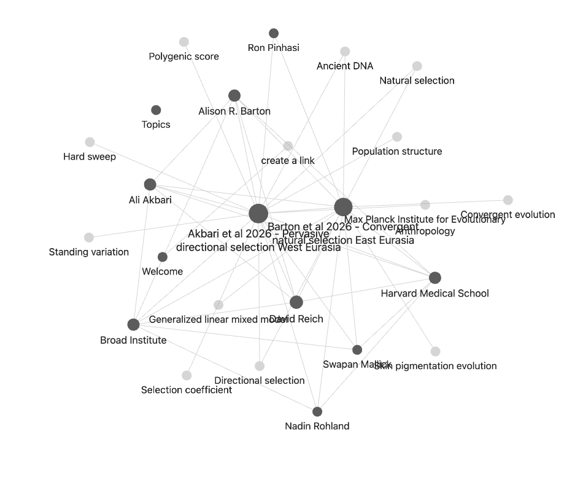

# 🧠 Second Brain — Build a Research Wiki With Your Agent

## Inspiration for this workshop

This workshop builds directly on the following prior work — read these to go deeper:

- [Andrej Karpathy — **LLM Knowledge Bases** gist](https://gist.github.com/karpathy/442a6bf555914893e9891c11519de94f) — the `raw/` → `wiki/` → Q&A pattern this tutorial implements
- [AgriciDaniel — **claude-obsidian** plugin](https://github.com/AgriciDaniel/claude-obsidian) — Claude chatting directly inside Obsidian
- [**Obsidian Web Clipper**](https://obsidian.md/clipper) — one-click web article → markdown for your `raw/` folder

## Overview

A **second brain** is a folder of markdown files that an agent reads, writes, and queries for you.
You drop raw sources into a `raw/` directory, the agent compiles a wiki of summaries and concepts with backlinks, and you ask it questions across the whole thing.

This tutorial follows the pattern Andrej Karpathy describes in [LLM Knowledge Bases](https://gist.github.com/karpathy/442a6bf555914893e9891c11519de94f):

> raw data from a given number of sources is collected, then compiled by an LLM into a .md wiki, then operated on by various CLIs by the LLM to do Q&A and to incrementally enhance the wiki, and all of it viewable in Obsidian. You rarely ever write or edit the wiki manually, it's the domain of the LLM.

You end up with a personal research wiki that grows every time you read a paper or answer a question.

This really suits research: we have lots of ideas, papers, meetings, and notes, and the aim is to connect them and find opportunities to get the most out of what's already sitting on your laptop.

---

## Prerequisites

- [opencode](https://opencode.ai) installed — see [Get OpenCode](./get-opencode)
- An API key (we hand out a shared [OpenRouter](https://openrouter.ai) key for the workshop)

You already have the agent. Next you need a note-keeping method.

---

## Step 1 — Download Obsidian

Options in this space include **Notion**, **Apple Notes**, and **Obsidian**. We prefer Obsidian: it's free, lightweight, stores everything as plain markdown files on your laptop, and works like most note-keeping apps.

1. Go to [obsidian.md](https://obsidian.md) and download for your OS.
2. Install and open it.

That's it. Obsidian is your viewer. Your agent will be the writer.

---

## Step 2 — Create a vault

A **vault** is just a folder of markdown files. Obsidian reads and renders whatever is inside.

In Obsidian:

1. Click **Create new vault**.
2. Name it `second-brain`.
3. Pick a location. For the workshop, put it inside your workshop folder. Longer term, keep your vault somewhere durable like `~/Documents/second-brain/` so it spans all your projects.

Inside the vault, create a `raw/` subfolder (Obsidian's file pane has a "new folder" button, or do it in Finder).

```
second-brain/
└── raw/
```

---

## Step 3 — Point opencode at the same folder

Open opencode in the vault folder:

```bash
cd ~/Documents/second-brain   # or wherever you put it
opencode
```

Both tools are now looking at the same directory. Obsidian renders the files. opencode writes them.

> If you haven't used Obsidian before, don't worry about learning the UI. Trust the agent to do the filing and use Obsidian just to read the result and click links.

---

## Step 4 — Drop in your raw sources

Put 3–5 papers into `raw/`. Any papers you actually want to think about, review articles and primary research work best for first-time use.

You can:

- Drag PDFs directly into the `raw/` folder
- Paste paper URLs (Nature, bioRxiv, etc.) into the opencode prompt and let the agent fetch them

> **Tip.** Keep filenames readable. `2026-barton-convergent-selection.pdf` is better than `s41586-026-10358-1.pdf`.

---

## Step 5 — Prompt the agent to build the wiki

You don't need an elaborate instruction file to start. Give the agent a plain-English prompt and let it organise the vault.

In **opencode**, paste something like:

```
Please organise my papers in a Karpathy wiki style.

Paper 1: https://www.nature.com/articles/s41586-026-10358-1
Paper 2: https://www.biorxiv.org/content/10.64898/2026.04.03.716344v1
```

Or if you've already dropped PDFs into `raw/`:

```
Please organise the papers in raw/ into a Karpathy wiki style.
Use Obsidian [[wiki-links]] to connect authors, institutions,
methods, and concepts across papers.
```

The agent will:

- Read each source
- Write a markdown summary per paper (authors, year, key findings)
- Create notes for shared concepts, authors, institutions, and methods
- Link them together with `[[wiki-links]]`

Watch the files appear in Obsidian's file pane. Click any link to jump between notes.

> **Takes too long?** Tell the agent to process 2 papers now and the rest in a second pass. Iterative is fine.

---

## Step 6 — Open the graph view

Obsidian's graph view is where the second brain earns its name. Open it with `Cmd/Ctrl + G` or click the graph icon in the left sidebar.

You should see your papers, authors, institutions, and concepts as connected nodes:



The example above is two ancient-DNA papers from the same lab. The agent picked up that they share authors (Ali Akbari, David Reich, Nadin Rohland), an institution (Harvard Medical School, Broad Institute, Max Planck Institute), and methods (directional selection, generalised linear mixed model, polygenic score). The two paper nodes end up linked through those shared ideas.

The bigger a node, the more things link to it. Hubs are usually your most load-bearing authors or concepts.

---

## Step 7 — Ask a cross-paper question

Now query across your wiki. Pick a question that no single paper answers on its own.

Good questions for a research second brain:

- *"Which papers cite the same upstream method or dataset, and where do they disagree?"*
- *"What are the three most-repeated limitations across my review articles?"*
- *"If I was writing an introduction to this topic, what would the 5 key references be and why?"*

Paste into opencode:

```
Using only the notes in this vault, answer this question:

<YOUR QUESTION>

Write the answer as a new markdown note with:
- a 2-3 paragraph answer
- a "Supporting evidence" section with direct quotes and [[wiki-links]] to the papers
- a "Further questions" section suggesting 3 follow-ups
```

Open the result in Obsidian and read it. Click the backlinks to verify the evidence against the original papers.

---

## Step 8 — Share what surprised you

Post in Slack: one connection the agent found that you didn't expect. A shared citation, a hidden thematic overlap, a contradicting finding. The "why did you group these?" reveal is often the best part.

---

## Why this works

The agent does three things humans are bad at:

1. **Reading every paper in the folder, every time.** You'd skim. It doesn't.
2. **Maintaining a consistent structure.** Frontmatter, backlinks, index — boring but useful.
3. **Re-compiling when new material arrives.** Drop a paper in `raw/`, re-run the prompt, and the concept notes update themselves.

You stay in the loop via **Obsidian as the viewer**. You read, critique, and ask follow-up questions. The agent does the filing.

Over weeks, the wiki becomes specific to your research. After ~100 articles, Karpathy writes, you can ask genuinely hard questions and the agent will "go off, research the answers, etc." — the context window holds enough of the wiki to reason across it without needing RAG.

---

## Keep growing it

After the workshop, the loop is:

1. Drop a new paper in `raw/` → ask the agent to update the wiki.
2. Have a new question → ask the agent to write the answer into a new note.
3. Periodically ask the agent to **lint** the vault: find inconsistencies, suggest new concept notes, propose merges.

The [stretch-goals tutorial](./10-second-brain-stretch) covers linting, a formal `AGENT.md` instruction file, the claude-obsidian plugin, and matplotlib-figure outputs.
