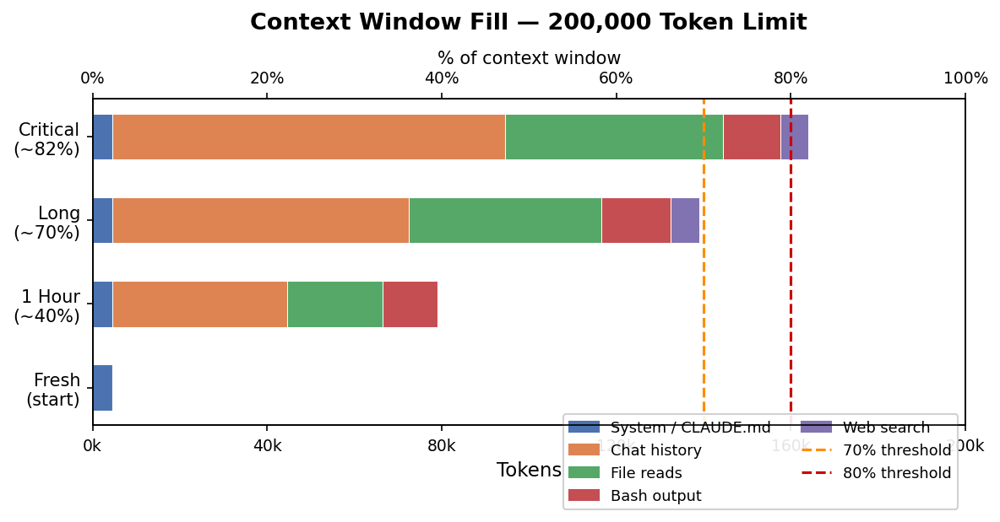

# Managing Context: Reducing Hallucinations and Run Costs

Long sessions fill the context window, burying your instructions under noise. The model forgets your conventions, hallucinates file contents, and every reply costs more.

---

## What is Context?

Every message re-sends the **entire conversation** to the API — your rules, all previous messages, every tool output. This bundle is the **context window**, measured in tokens (~0.75 words each). All Claude models support 200,000 tokens (~1,500 pages).

**What fills it:**
- System prompt / CLAUDE.md — fixed overhead every session
- Chat history — grows ~1k tokens per turn
- File reads — one 500-line file ≈ 3k tokens
- Bash/test output — a single stack trace ≈ 5k–20k tokens ← *silent killer*
- Web search results — 5k–10k per search

**How a session fills up:**



---

## Context Rot and Cost

**Context rot** happens past ~70%: early instructions get buried, the model attends to recent noise over old rules, hallucinations increase.

**Cost** scales linearly — every message re-sends the full window. 50 messages at 150k tokens on Sonnet = **$22.50 in input costs alone**.


| Model | $/MTok | @ 50k | @ 150k | @ 200k |
|---|---|---|---|---|
| GPT-4o mini | $0.15 | $0.01 | $0.02 | $0.03 |
| **Kimi K2.5 ★** | **$0.60** | **$0.03** | **$0.09** | **$0.12** |
| Claude Haiku 4.5 | $1.00 | $0.05 | $0.15 | $0.20 |
| Gemini 1.5 Pro | $1.25 | $0.06 | $0.19 | $0.25 |
| GPT-4o | $2.50 | $0.13 | $0.38 | $0.50 |
| Claude Sonnet 4.6 | $3.00 | $0.15 | $0.45 | $0.60 |
| Claude Opus 4.6 | $5.00 | $0.25 | $0.75 | $1.00 |

★ Kimi K2.5 is the model used in this course (via OpenRouter). Even so, 50 messages × 150k tokens = **$4.50**. Context management is a billing issue, not just a quality issue.

---

## The Solution: `/compact`

Type `/compact` in Claude Code at any time. It summarises the entire conversation into a structured digest (~5k tokens) and discards the raw history — typically a **97% reduction**.

Run it after completing a task, before starting something new, or when context hits ~50%.

> **Auto-compact warning:** The automatic trigger at 80% only saves titles and brief excerpts — not full content. Don't rely on it. Use `/compact` manually and use PLAN.md (below) for real continuity.

---

## PLAN.md — Your Session Handoff File

The real fix for context rot is keeping durable state in **files, not history**. One file — `PLAN.md` — updated every session, is all you need.

**In your first session, ask Claude to create:**

```markdown
# PLAN.md

## Goal
[What you are building and why — one paragraph]

## Key Decisions
[Tech stack, design choices, constraints]

## Stages
### Stage 1 — ✅ Complete
- [x] Task A

### Stage 2 — 🔄 In Progress
- [x] Task B
- [ ] Task C

## Progress: 40%

## Next Actions
1. First next step
2. Second next step

## Session Notes
[Date] — [What was decided]
```

**At the end of every session:**
```
Update PLAN.md — mark completed tasks, update progress %, write next actions.
```

**To start the next session:**
```
Claude, continue with PLAN.md
```

Claude reads the file, picks up exactly where you left off, no recap needed. Keep **one** PLAN.md — never plan-v2.md, plan-final.md, etc.

| File | Purpose | Loads |
|---|---|---|
| `CLAUDE.md` | Permanent style & conventions | Automatically, every session |
| `PLAN.md` | Current project progress | On demand: "continue with PLAN.md" |
| `memory/decisions.md` | Why choices were made | When you need the history |

---

## Atomic Tasks: GSD and the Ralph Loop

Planning docs work best when tasks are **atomic** — completable in one session with a clean context.

**GSD workflow:**
```
Spec → Roadmap → Atomic Tasks → Fresh Session → Implement → Verify → Done
                                     ↑ loop if fails ↑
```

Each task gets its own fresh session. State lives in files, not history.

**Ralph Loop** (Geoffrey Huntley) automates this: each iteration spawns a clean context, reads from `task.md` and `review-feedback.txt`, does the work, then exits. A separate reviewer model checks the output and either ships it or writes feedback for the next iteration. Failed attempts never pollute the context.

| Size | Example | Risk |
|---|---|---|
| Too large | "Build the analysis pipeline" | Guaranteed rot |
| Good | "Write the DESeq2 wrapper with tests" | Low |
| Good | "Fix the NA bug in normalise_counts()" | Very low |

If you can't describe "done" in two sentences, split the task.

---

## Advanced Techniques

**Prompt caching** — when running automated loops, your CLAUDE.md is re-processed every iteration. Add `cache_control` to cache it at 10% of normal price:

```python
system=[{"type": "text", "text": "...CLAUDE.md...", "cache_control": {"type": "ephemeral"}}]
```

**Token budgeting** — tell the agent exactly what to return:
```
Read only the normalise_counts function — not the whole file
Summarise test output in 10 lines, failures only
```

**Multi-agent parallelism** — split independent tasks across separate agents, each with a clean context window. They write results to shared files; a coordinator synthesises.

**Automated hooks** — key hooks for context management:

| Hook | Use |
|---|---|
| `SessionStart` (matcher: `compact`) | Re-inject `PLAN.md` after auto-compact |
| `PreCompact` | Write state to memory files before compaction |
| `Stop` | Check task completion, keep looping if not done |

---

## Summary

| Concept | What to do |
|---|---|
| Context rot | `/compact` before hitting 70%, not after |
| Session handoff | Keep `PLAN.md` updated — "continue with PLAN.md" |
| Task sizing | One task per session, describable in two sentences |
| Cost | 50 messages × 150k tokens = $4.50 (Kimi) to $22.50 (Sonnet) |
| Automation | Prompt caching + hooks for repeated agentic loops |

---

## Further Reading

- [Everything is a Ralph Loop — Geoffrey Huntley](https://ghuntley.com/loop/)
- [Ralph Loop — Goose docs](https://block.github.io/goose/docs/tutorials/ralph-loop/)
- [GSD + BMAD overview](https://pasqualepillitteri.it/en/news/158/framework-ai-spec-driven-development-guide-bmad-gsd-ralph-loop)
- [Anthropic: Building Effective Agents](https://www.anthropic.com/engineering/building-effective-agents)
