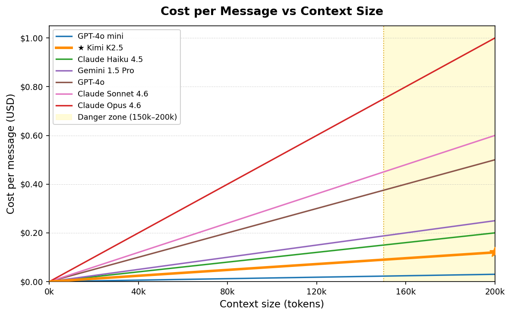

# Managing Context: Reducing Hallucinations and Run Costs

Long sessions fill the context window, burying your instructions under noise. The model forgets your conventions, hallucinates file contents, and every reply costs more.

---

## What is Context?

Every message re-sends the **entire conversation** to the API — your rules, all previous messages, every tool output. This bundle is the **context window**, measured in tokens (~0.75 words each). All Claude models support 200,000 tokens (~1,500 pages).

**What fills it:**
- System prompt / CLAUDE.md — fixed overhead every session
- Chat history — grows ~1k tokens per turn
- File reads — one 500-line file ≈ 3k tokens
- Bash/test output — a single stack trace ≈ 5k–20k tokens ← *silent killer*
- Web search results — 5k–10k per search

---

## Context Rot and Cost

**Context rot** happens past ~70%: early instructions get buried, the model attends to recent noise over old rules, hallucinations increase.

**Cost** scales linearly — every message re-sends the full window. 50 messages at 150k tokens on Sonnet = **$22.50 in input costs alone**.



| Model | $/MTok input | Context window | @ 50k | @ 150k | @ max |
|---|---|---|---|---|---|
| GPT-4o mini | $0.15 | 128k | $0.01 | $0.02 | $0.02 |
| **Kimi K2.5 ★** | **$0.60** | **256k** | **$0.03** | **$0.09** | **$0.15** |
| Claude Haiku 4.5 | $1.00 | 200k | $0.05 | $0.15 | $0.20 |
| Gemini 1.5 Pro | $1.25 | 2M | $0.06 | $0.19 | $2.50 |
| GPT-4o | $2.50 | 128k | $0.13 | $0.38 | $0.32 |
| Claude Sonnet 4.6 | $3.00 | 200k | $0.15 | $0.45 | $0.60 |
| Claude Opus 4.6 | $5.00 | 200k | $0.25 | $0.75 | $1.00 |

★ Kimi K2.5 is the model used in this course (via OpenRouter). Even so, 50 messages × 150k tokens = **$4.50**. Context management is a billing issue, not just a quality issue.

For up-to-date pricing and context window specs across all models, see [models.dev](https://models.dev/).

**Check your context at any time** with `/context`. Here's real output from the session used to write this tutorial (reading files, running web searches, generating charts):

```
❯ /context

  Context Usage
  claude-sonnet-4-6 · 56k/200k tokens (28%)

  Estimated usage by category
  System prompt:   3.5k tokens  (1.7%)
  System tools:     21k tokens (10.5%)
  MCP tools:       4.7k tokens  (2.3%)
  Skills:           <1k tokens  (0.0%)
  Messages:        28.2k tokens (14.1%)
  Compact buffer:    3k tokens  (1.5%)
  ─────────────────────────────────────
  Free space:       140k tokens (69.8%)
```

A few things stand out here: **system tools (10.5%)** — Claude Code's built-in tool definitions are re-sent every message even when unused. **MCP tools** add another 2.3% just for being registered, regardless of use. Both are fixed overhead you can't compress away — only `/compact` or a fresh session resets them.

---

## The Solutions: `/clear` and `/compact`

**`/clear`** resets the conversation entirely — zero history, zero tool outputs, back to just the system prompt. Use it between unrelated tasks or when the session has gone off track. It's instant and free.

**`/compact`** summarises the entire conversation into a structured digest (~5k tokens) and discards the raw history — typically a **97% reduction**. Unlike `/clear` it preserves continuity: decisions, file states, and completed work survive in the summary. Use it when you want to keep going on the same task with a lighter context.

| | `/clear` | `/compact` |
|---|---|---|
| History after | Gone | Summarised (~5k tokens) |
| When to use | Between tasks, fresh start | Mid-task, keep continuity |
| Cost | Free | One summary call |

> **Auto-compact warning:** The automatic trigger at 80% only saves titles and brief excerpts — not full content. Don't rely on it. Use `/compact` manually.

---

## Further Reading

- [GSD and the Ralph Loop](gsd-ralph.md) — atomic tasks, PLAN.md handoff, and automation scripts
- [Anthropic: Building Effective Agents](https://www.anthropic.com/engineering/building-effective-agents)
