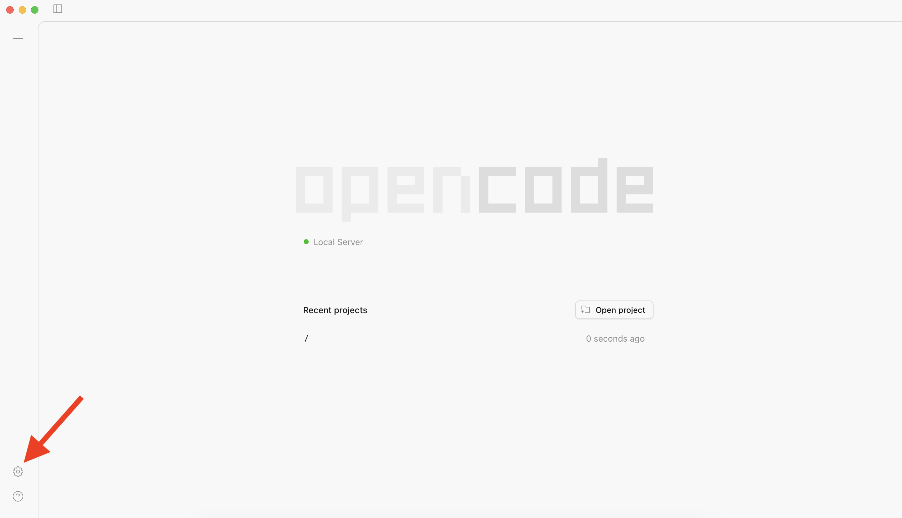
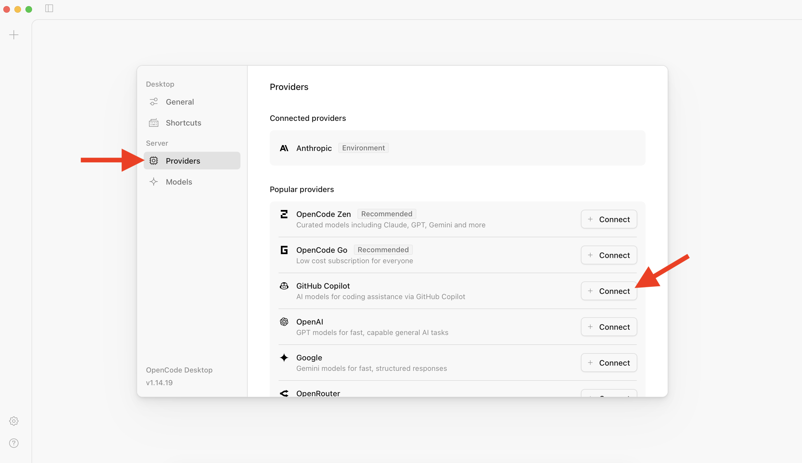
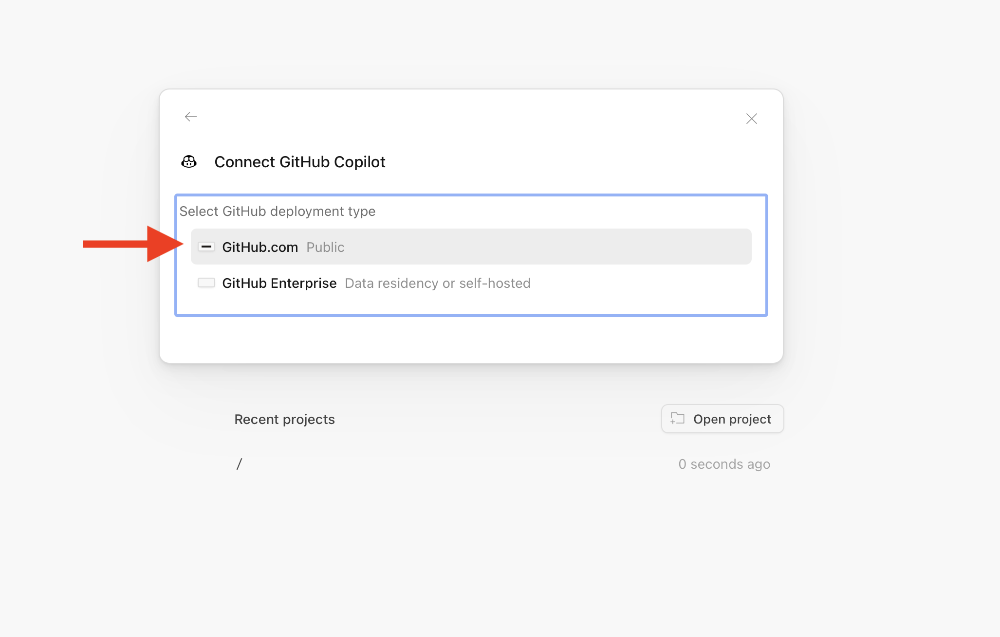
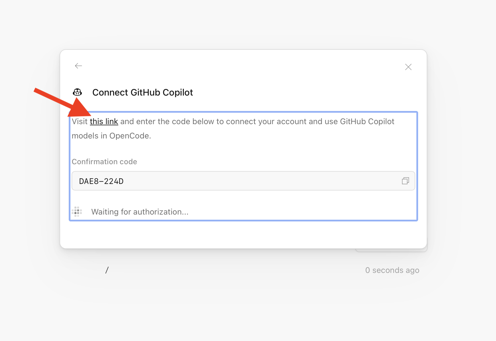
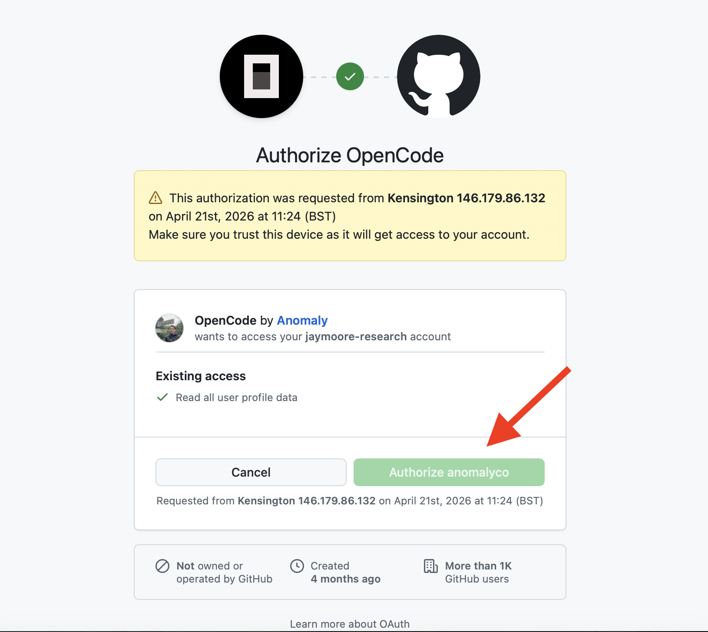
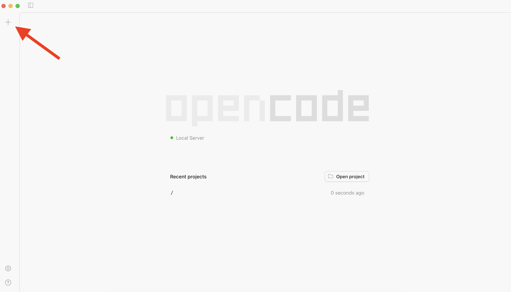
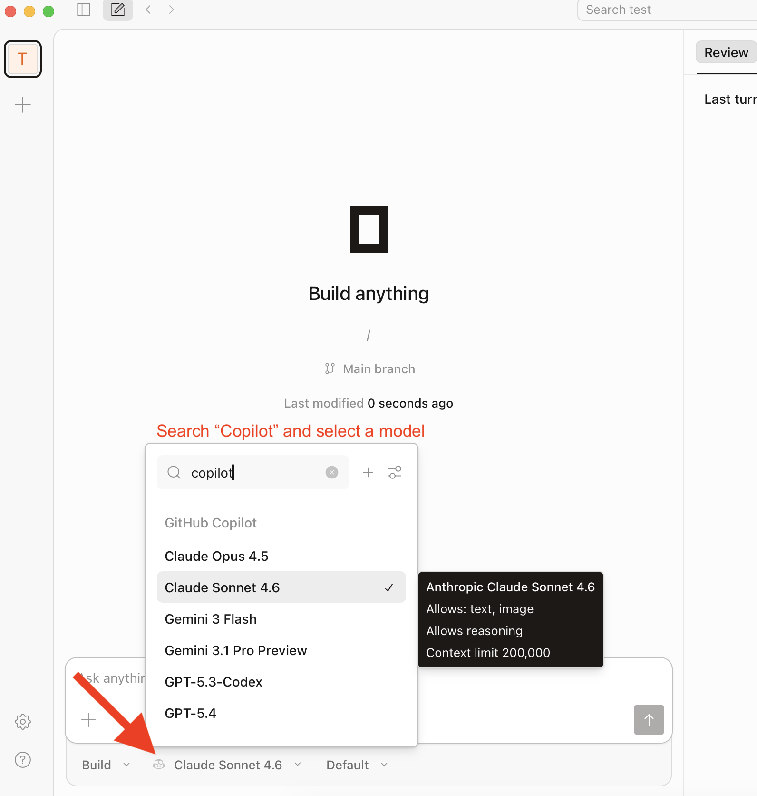

# Get OpenCode — Download and Connect to Copilot

## Overview

[OpenCode](https://opencode.ai/) is an open-source desktop coding agent. Once installed, it can connect to **GitHub Copilot** as a provider, which means you get access to Claude Opus 4.5 and the other premium models bundled with your Copilot Pro subscription — no extra API key needed.

This page walks through: download, pick Copilot as the provider, sign in with GitHub, verify the connection, start a session, and choose a model.

> **Prerequisite:** Copilot Pro active on your GitHub account. If you are a student or faculty, follow [GitHub Education — Free Copilot Access](./github-education) first.

## Watch the full walkthrough

The YouTube series is the most complete guide — screenshots below mirror the same steps.

  <iframe
    width="100%"
    height="420"
    src="https://www.youtube.com/embed/videoseries?list=PL4pSvJm1oWAuleZiQf6DMJmhnjGI_mh-l"
    title="Agentic AI in Life Science — full playlist"
    frameborder="0"
    allow="accelerometer; autoplay; clipboard-write; encrypted-media; gyroscope; picture-in-picture"
    allowfullscreen>
  </iframe>

<a href="https://www.youtube.com/playlist?list=PL4pSvJm1oWAuleZiQf6DMJmhnjGI_mh-l" target="_blank" rel="noopener">▶ Open the <strong>Agentic AI in Life Science</strong> playlist on YouTube</a>

---

## Steps

### Step 1 — Download and install OpenCode

1. Go to [opencode.ai/download](https://opencode.ai/download)
2. Download the build for your OS (macOS, Windows, Linux)
3. Install and launch the app
4. Make a project folder first, e.g. create a `testing AI` folder in your `Documents`. OpenCode needs a project folder to work in.

### Step 2 — Open Settings

Click the ⚙️ gear icon in the bottom-left corner of the OpenCode window.

### Step 3 — Choose GitHub Copilot as the provider

1. In Settings, open the **Providers** tab
2. Select **GitHub Copilot**

### Step 4 — Start GitHub sign-in

Click the **github.com** link (or **Sign in with GitHub**) to begin OAuth device authorisation.

### Step 5 — Verify the device code

OpenCode shows a short code and opens `github.com/login/device` in your browser. Enter the code there to verify.

### Step 6 — Authorise OpenCode

GitHub asks you to authorise OpenCode to access your Copilot subscription. Click **Authorize**.

### Step 7 — Start a new session

Back in OpenCode, click the **＋** button to create a new project session and point it at your `testing AI` folder.

### Step 8 — Select a Copilot model

Open the model picker and search `copilot`. Pick **Claude Opus 4.5** (or any other model available through your Copilot subscription — GPT-4.1, Gemini, etc.).

You are now running OpenCode on Copilot-hosted Claude. Return to the [Setup tutorial](./01-setup) to start your first prompt.

---

## Troubleshooting

- **No Copilot models appear.** Confirm Copilot Pro is active at [github.com/settings/copilot](https://github.com/settings/copilot). Education benefits can take up to 72 hours to propagate.
- **Device code expired.** Close Settings, reopen, click **github.com** again to request a fresh code.
- **"Not authorised" after sign-in.** Your org may restrict third-party OAuth apps. Check [github.com/settings/applications](https://github.com/settings/applications) and approve OpenCode, or ask your org admin.

## Alternative — OpenRouter instead of Copilot

If you do not have Copilot Pro, you can use [OpenRouter](https://openrouter.ai) as the provider instead. Same flow, but in Step 3 pick **OpenRouter** and paste an OpenRouter API key. Free models on OpenRouter may train on your data — check each model's policy before use.
