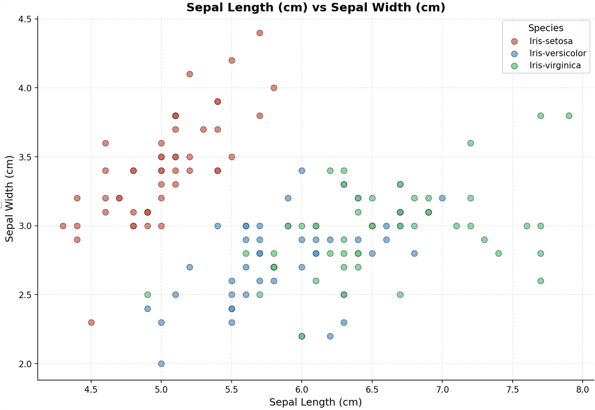

# Example: Iris Dataset Analysis

This tutorial walks you through using OpenCode to analyze the classic Iris dataset and create visualizations.

## What you'll learn

- How to use `Plan` mode to guide AI interactions
- How to prompt for data analysis tasks
- How to get AI to create figures and export them

## Steps

1. Download an example "Iris dataset" to your folder. This will be an example dataset to use: https://archive.ics.uci.edu/static/public/53/iris.zip. Open the zip folder.

2. Switch to `Plan` mode. This is a mode that won't start to make things. It will ask you questions to help guide your progress.

3. Use this prompt:

```
Make me some figures of the Iris dataset attached. 
Output the figure in an Excel file.
```

4. Interact with the `Plan`. For this example I replied that I want scatter plots. This is where you can influence what the model does. This is the major advantage over other chatbots.

5. Change from `Plan` mode to `Build` mode and begin planned tasks by prompting it to begin (i.e. "yes").

6. If it gets stuck with an error, prompt `complete analysis` and it will continue working until the end.

## Results

Here is the output from this interaction: [iris_pairwise_scatter_plots.xlsx](https://github.com/user-attachments/files/25074321/iris_pairwise_scatter_plots.xlsx)

This is one of the figures it made:



## Tips

- Be specific in your prompts about what you want (e.g., "scatter plots", "histograms", "correlation matrix")
- The `Plan` mode lets you refine the approach before the AI starts working
- You can always interrupt and redirect if it's going in the wrong direction
