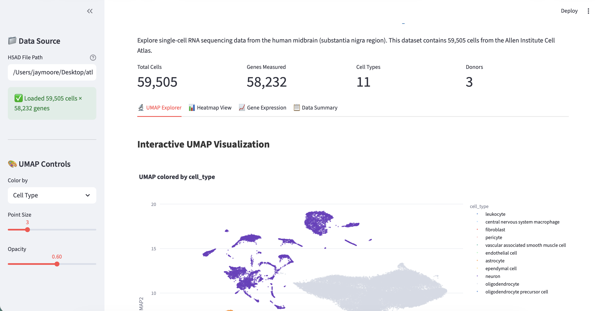

# Data Portal for Single Cell Sequencing

Build an interactive viewer for single-cell RNA sequencing data using public datasets from the [CZ CELLxGENE](https://cellxgene.cziscience.com/) data portal.

## Organise project

1. Make a new repo for your project

2. Download [Github command line](https://github.com/cli/cli)

3. Download the repo to your computer. You can clone it using command line or ask agents to setup the repo.

4. Make a data folder outside of your repo

## Get single-cell data

1. Browse the [CELLxGENE collections](https://cellxgene.cziscience.com/) and find a dataset. For this example we use the [Allen Institute Adult Human Brain Atlas](https://cellxgene.cziscience.com/collections/283d65eb-dd53-496d-adb7-7570c7caa443) - specifically the [midbrain (substantia nigra) snRNA-seq dataset](https://datasets.cellxgene.cziscience.com/5cfe2ee0-d62a-487c-b0fe-124f39f4df21.h5ad).

2. Download the `.h5ad` file to your laptop (it is 416.2 MB). The dataset contains 59,505 cells x 58,232 genes with 11 cell types across 3 donors. Key metadata columns include `cell_type`, `cluster_id`, `supercluster_term`, `donor_id`, and UMAP coordinates in `obsm['X_UMAP']`. 

## Get prompting!

1. In `Plan` mode:

```
I have a single-cell RNA sequencing h5ad file in a folder called [you_folder_name]. Build me an interactive
website app to explore this data. Include:
- A UMAP plot colored by cell type and cluster
- A heatmap of cell type vs cluster
Make sure not to read the whole data, just check meta data.
```

2. In the `Plan` mode I chose to use Streamlit because it said it was easy to use :) Work with the AI to make what you want.

## Result



